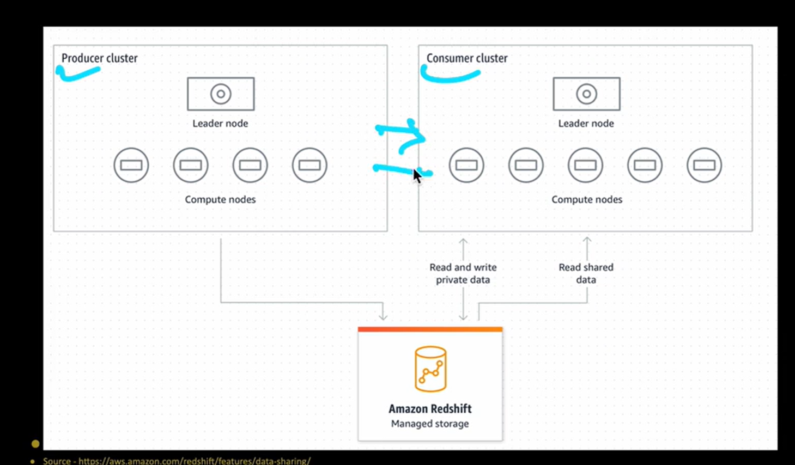
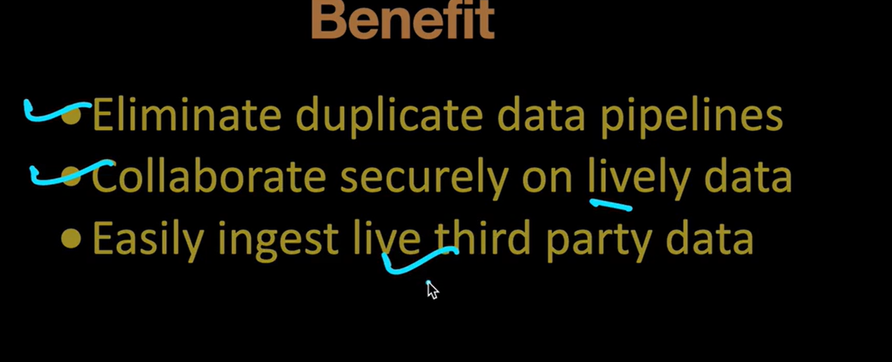
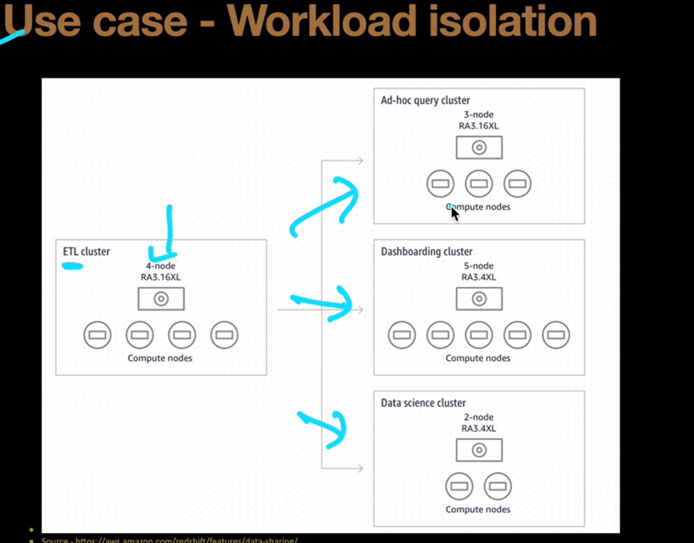
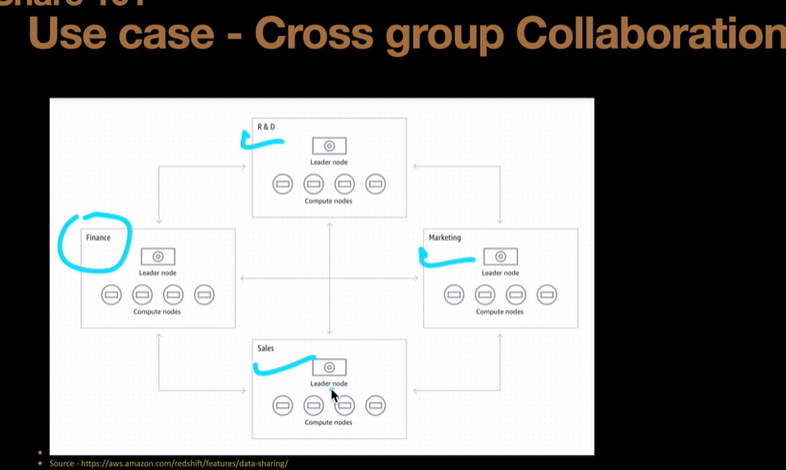
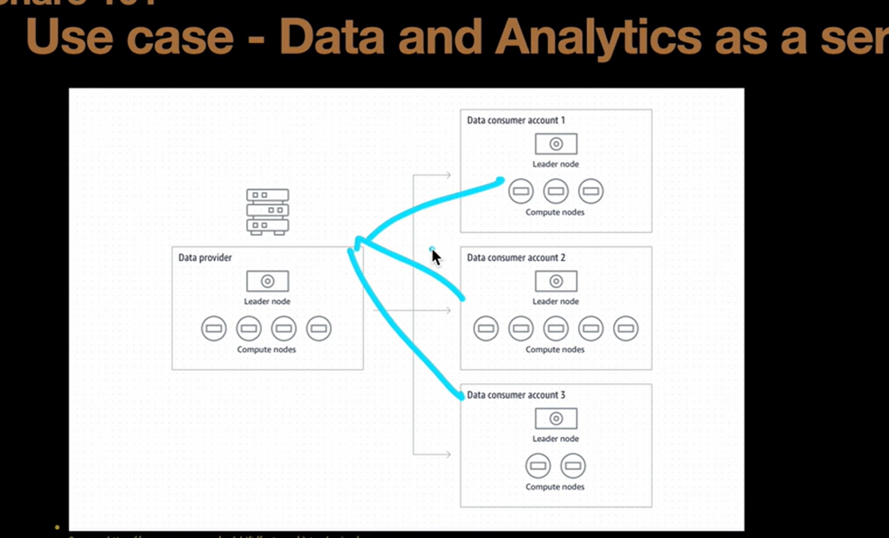
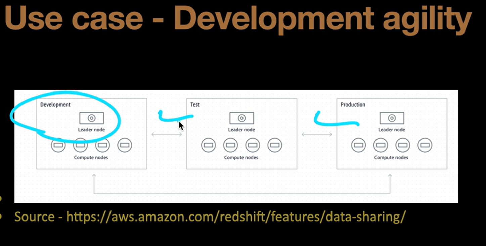
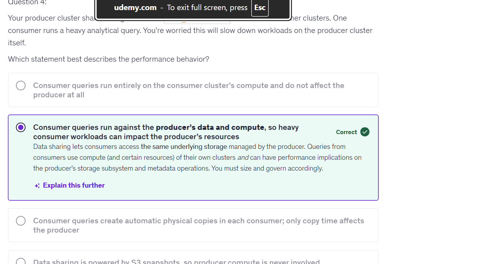

## What is Data Sharing in Redshift?

It lets one Redshift environment expose its live data to another Redshift environment without copying that data.

## Check the datashare.sql ( how to create the datashare for consumer)

### Benifits and Advantages

| Benefit                 | Why it matters                             |
| ----------------------- | ------------------------------------------ |
| No full data copy       | Avoids duplicate storage                   |
| Live data               | Consumers see committed producer changes   |
| No replication pipeline | Less ETL/maintenance                       |
| Workload isolation      | Consumer queries use consumer compute      |
| Independent scaling     | Each consumer can size compute separately  |
| Cross-account sharing   | Useful for organizations/partners          |
| Cross-Region sharing    | Useful for global architectures            |
| Granular sharing        | Share selected objects                     |
| Security                | Consumer sees only shared metadata/objects |
| Faster access to data   | Removes replication delay                  |

## Quesiton 

* Correction - 

1. Consumer queries execute on the consumer's compute resources while accessing data shared from the producer; although compute is isolated, shared storage and metadata operations can still create performance implications on the producer.

2. Data Sharing separates compute workloads, but the data itself remains producer-owned/shared, so producer-side storage and metadata resources can still be affected.

3. Query performance is primarily determined by the consumer's compute capacity.