* How to improve the performence of the copy command 

# Quick Summary 

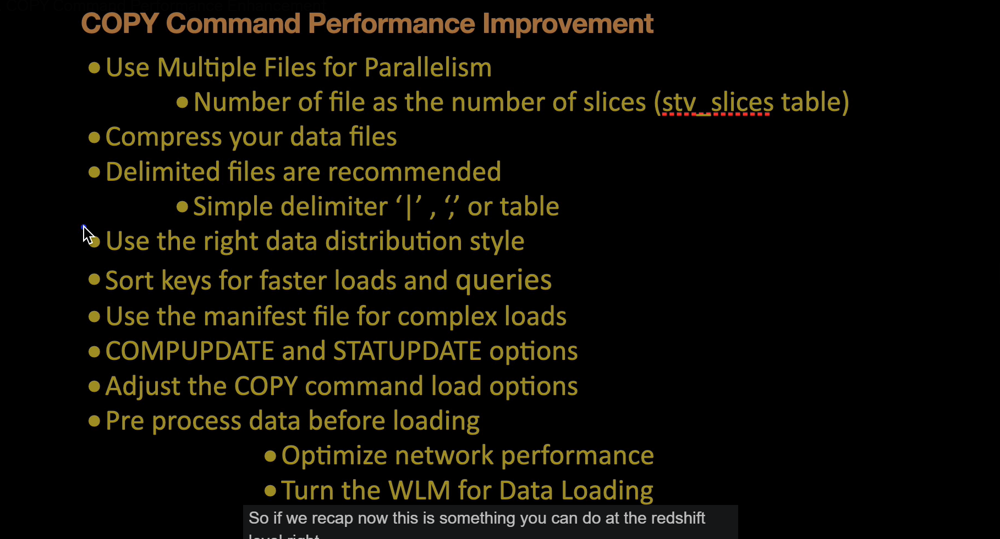
- load the multiple files at a time 

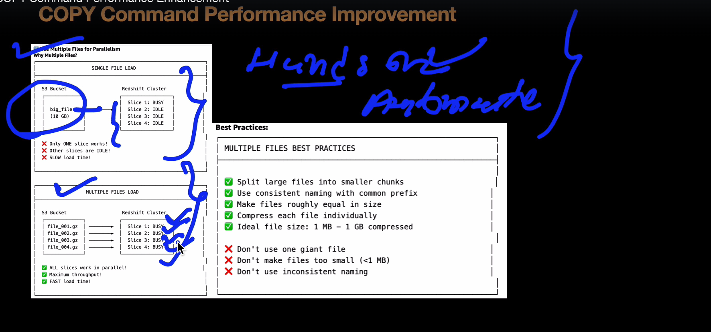

- Number of files equal to the number of slices 

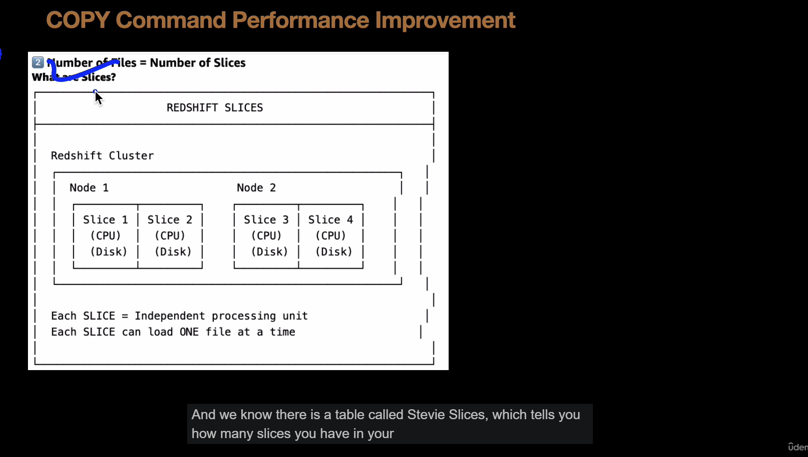

- compress the data file 

- use the delimeted files

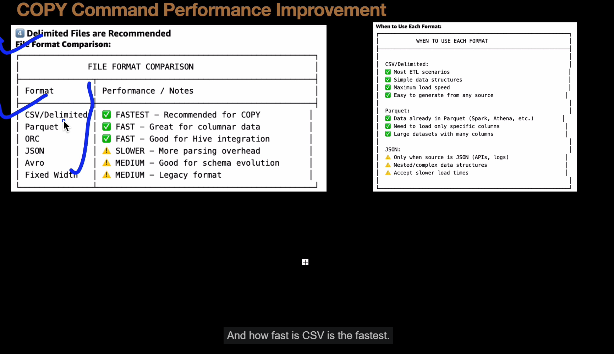

- using data distribution 

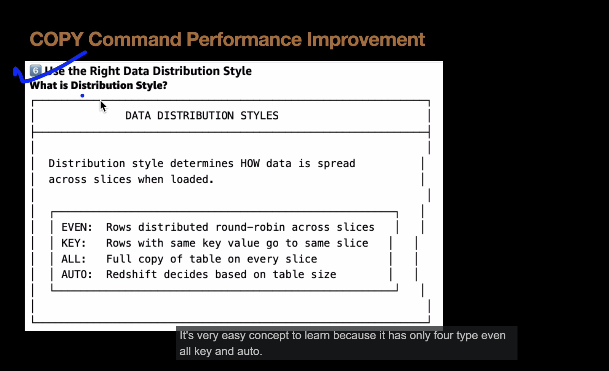

- use sort key 

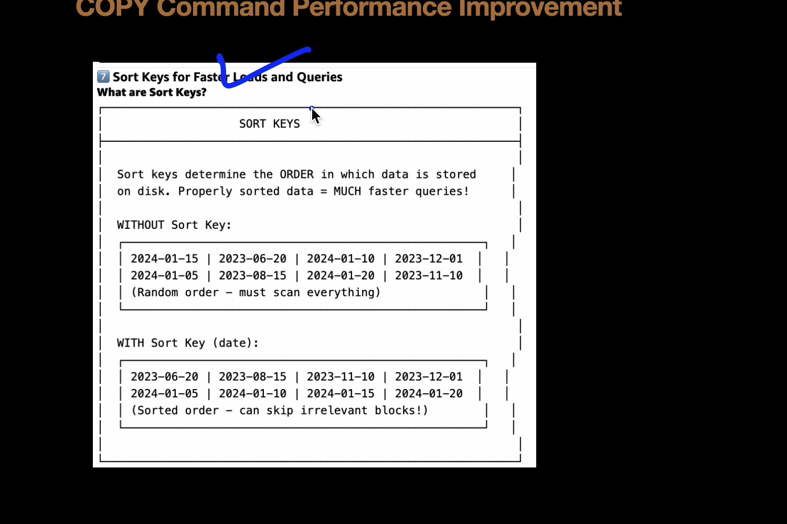

- use the manifest file 

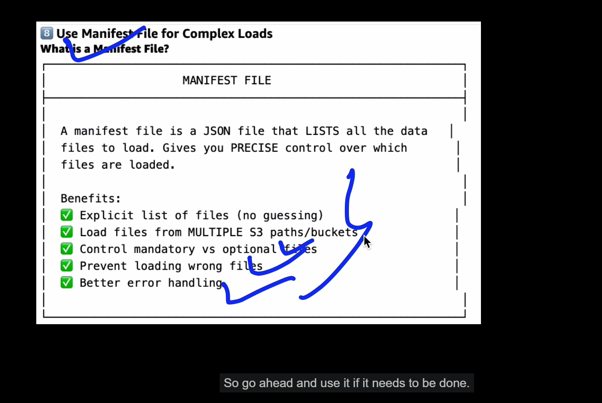

- keep computeupdate and statusupdte as off 

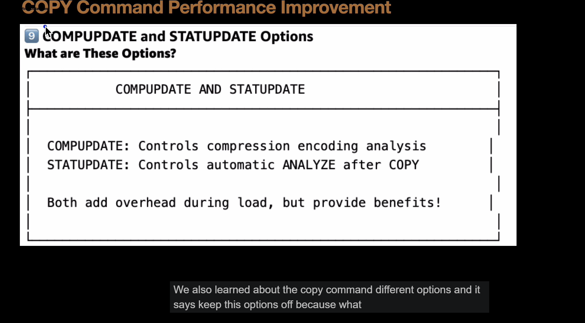

- adjust the copy command options

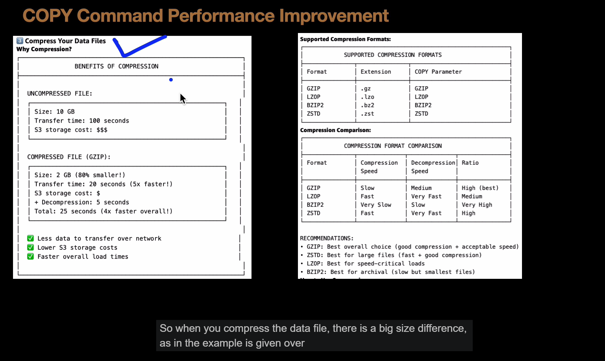

- preprocess the data before loading

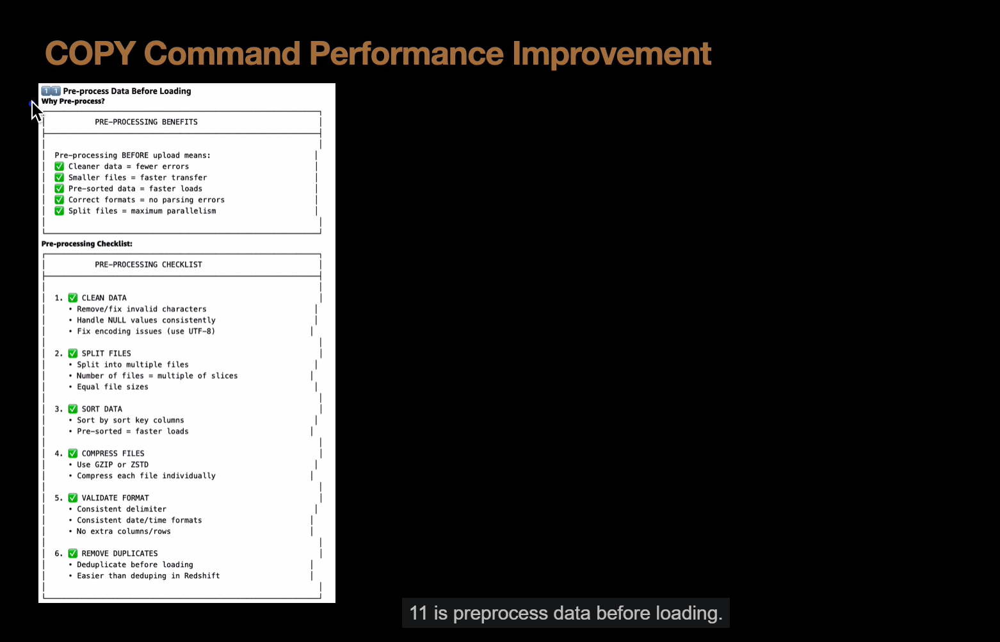

- optimize network performence , do not use cross region queries

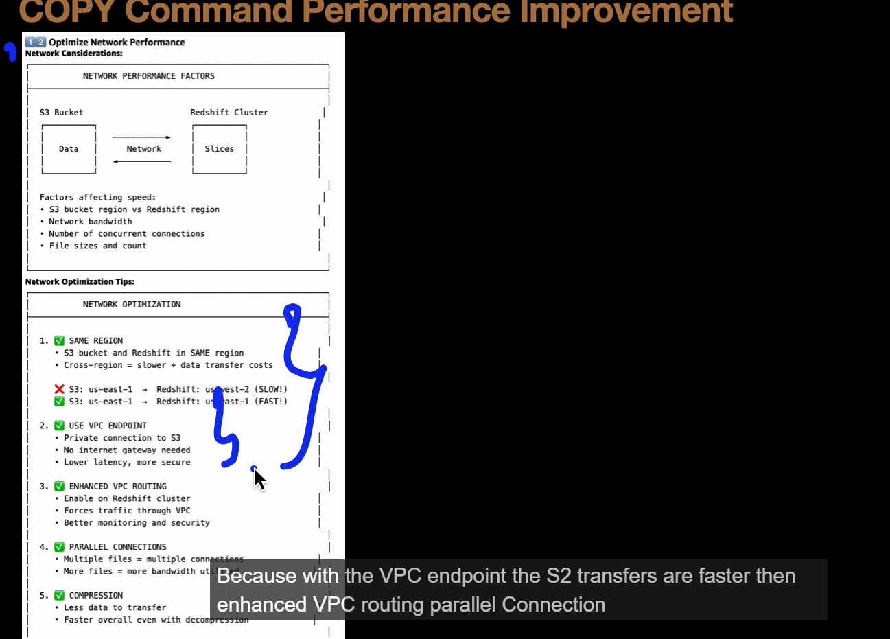

