* How to improve the performence of the copy command 

# Quick Summary 

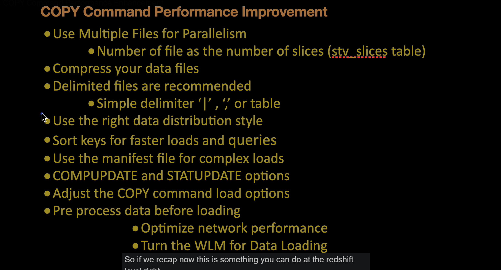
- load the multiple files at a time 

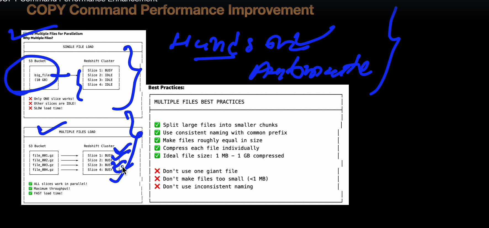

- Number of files equal to the number of slices 

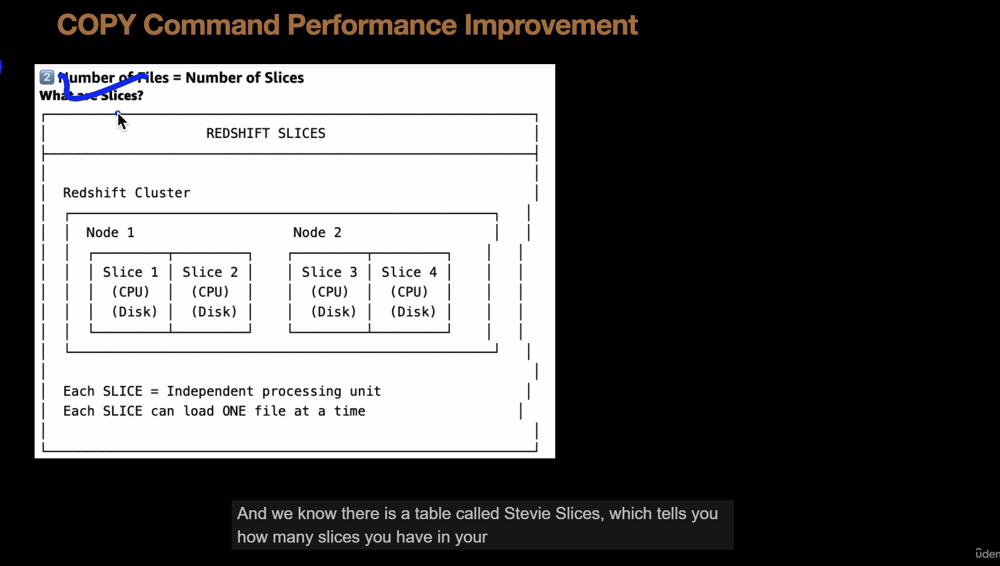

- compress the data file 

- use the delimeted files

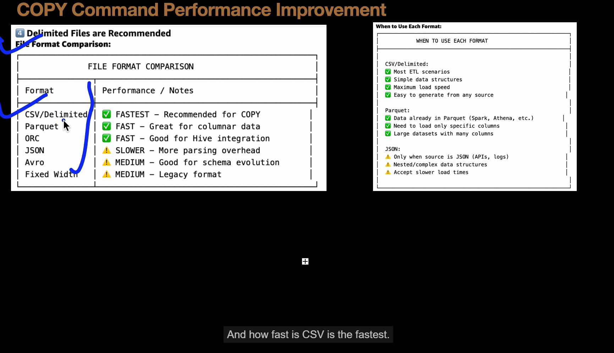

- using data distribution 

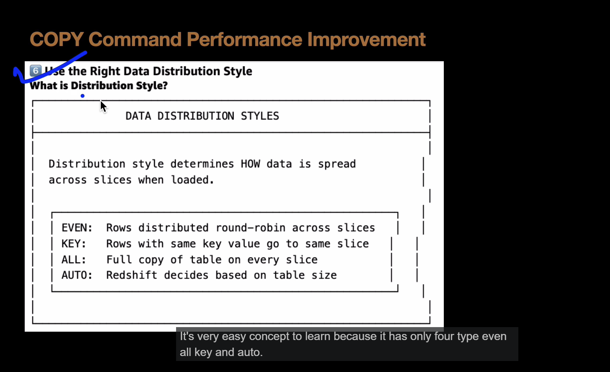

- use sort key 

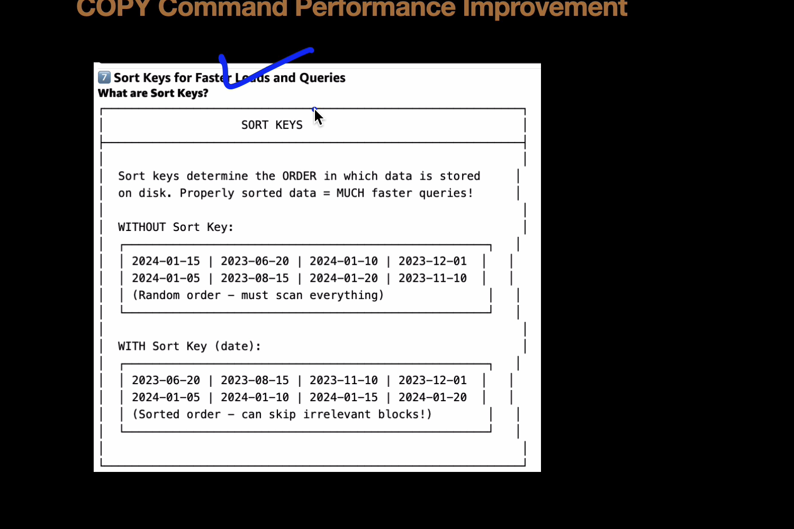

- use the manifest file 

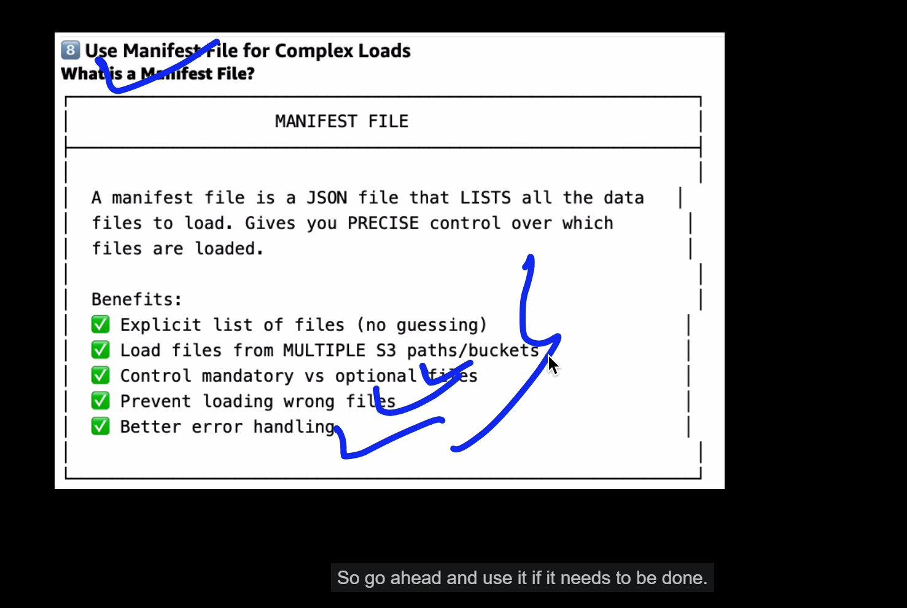

- keep computeupdate and statusupdte as off 

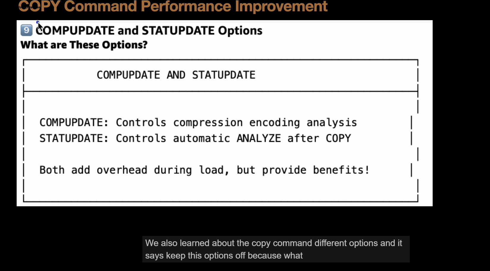

- adjust the copy command options

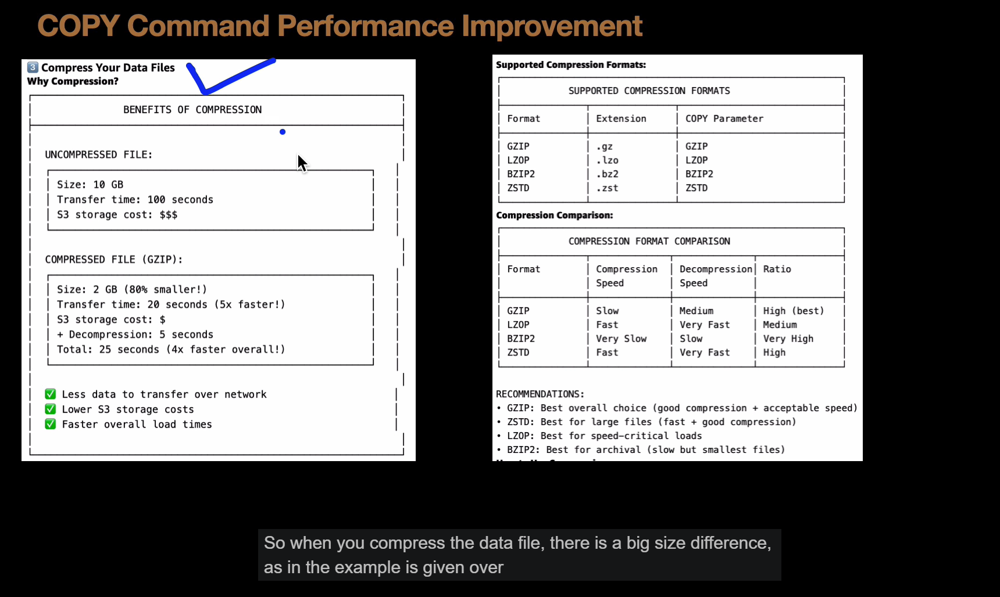

- preprocess the data before loading

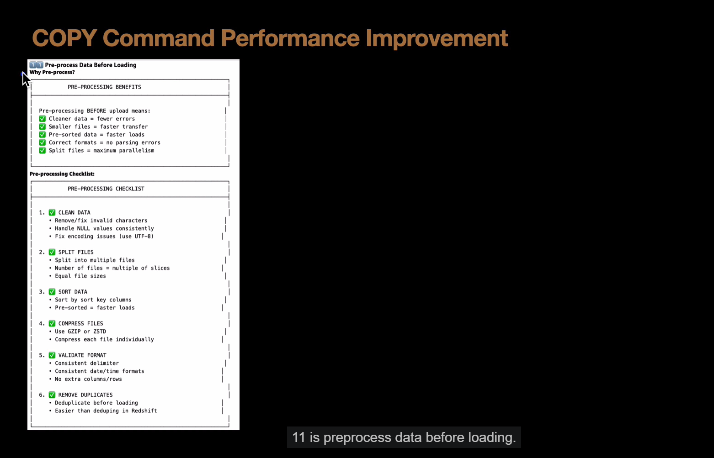

- optimize network performence , do not use cross region queries

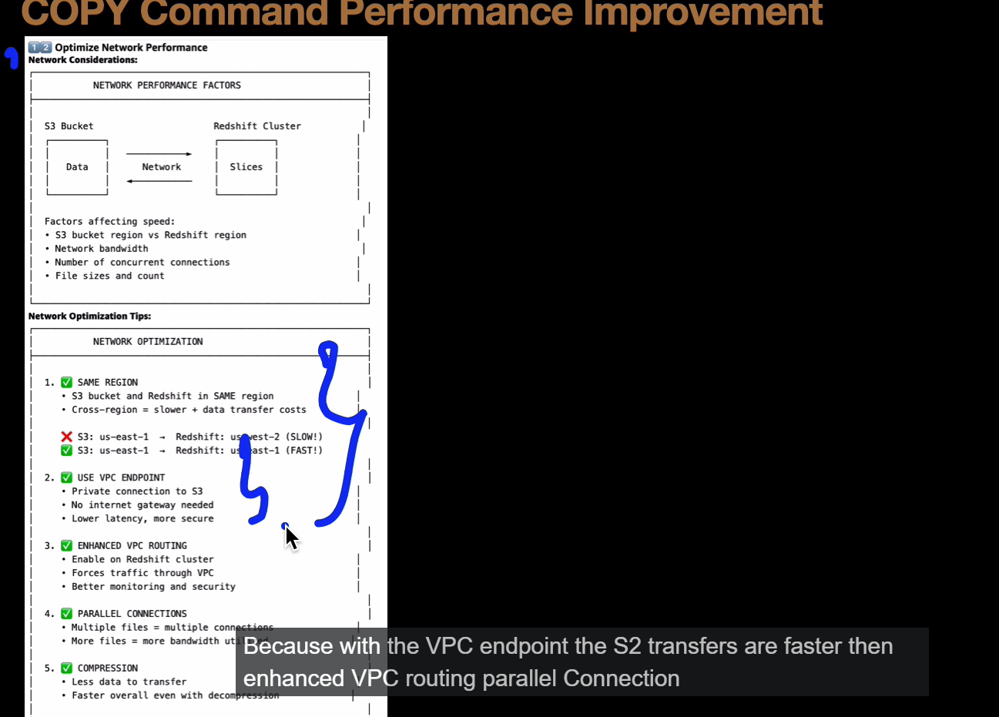

## How to connect the Redshift Warehouse with Lambda function

 1. Step 1: Create a Redshift cluster and configure the security group to allow access from your Lambda function.
 2. Step 2: Create an IAM role for your Lambda function with the necessary permissions to access Redshift. Also provide the inline policy to allow access to the Redshift cluster.

    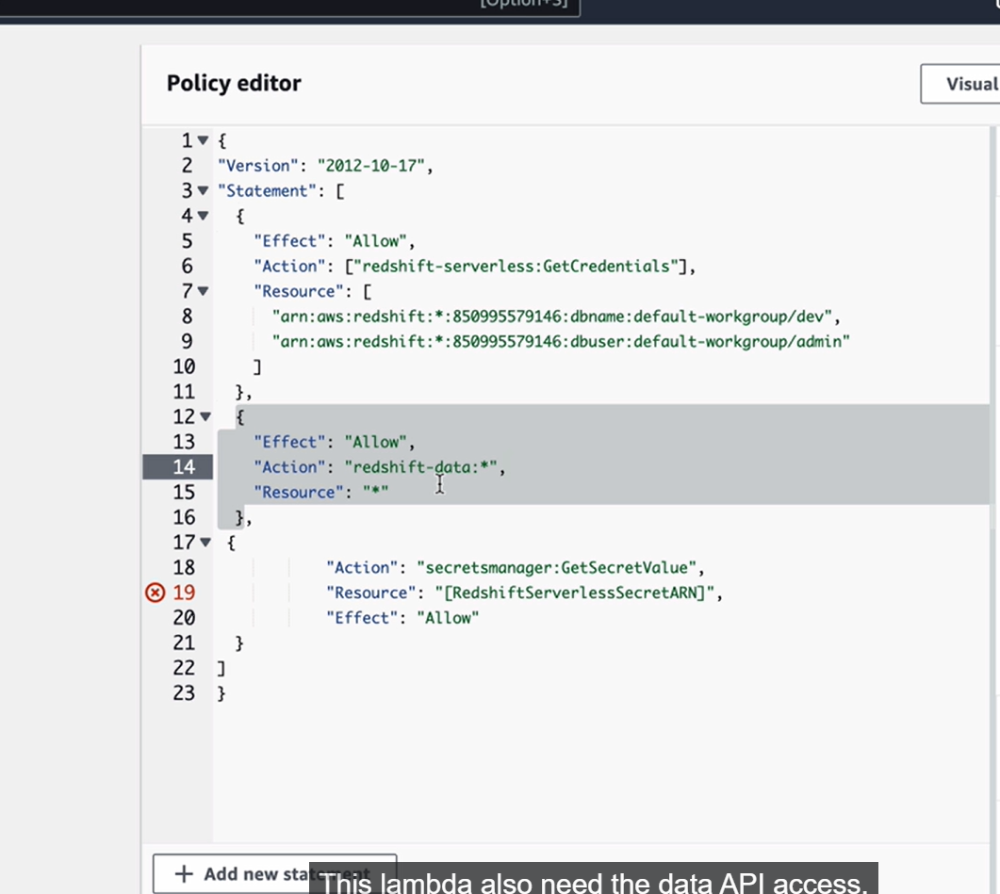

3. Step 3: Create a Lambda function and attach the IAM role created in step 2. Use the AWS SDK for Python (Boto3) to connect to the Redshift cluster and execute SQL queries.

4. 