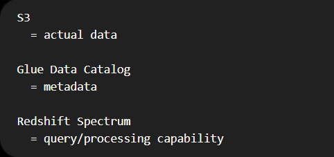
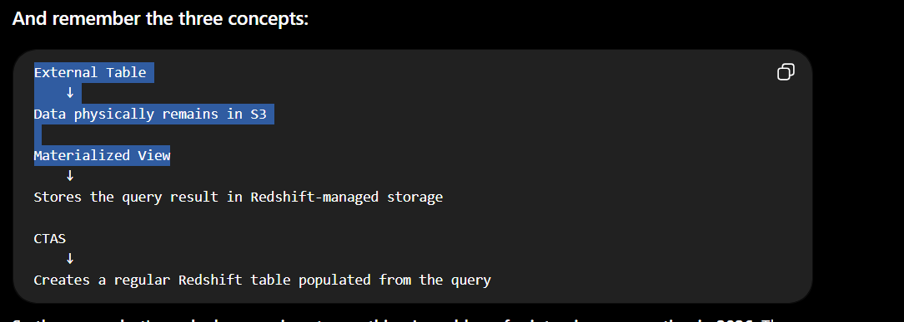

## What is Redshift Spectrum?

Redshift Spectrum is a query engine that allows you to run SQL queries against data stored in Amazon S3. It enables you to analyze large datasets without having to load them into Redshift clusters, making it easy to perform analytics on data that is already in S3.

- Do not consider Redshift Spectrum as a separate database. It is a data-lake query capability/engine associated with Redshift that lets Redshift run SQL directly against files in Amazon S3, without first loading those files into Redshift storage.

- For RA3/DC2 provisioned clusters, Spectrum runs on a dedicated server fleet outside your cluster; `but Redshift Serverless and newer RG provisioned clusters use an integrated data-lake query engine instead `

* Internal Redshift table
`CREATE TABLE sales (...);`

* Data:

               Redshift
                  │
                  ▼
          Redshift storage
        (managed warehouse data)

- Rows are physically loaded into Redshift's storage.

* External table

`CREATE EXTERNAL TABLE sales (...);`

- Data 

          External Table
                │
          metadata only
                │
                ▼
               S3
        actual data files

- The external table does not own the data. It tells Redshift: "There are files at this S3 location; here is their schema and format. Query those files as a table."

               Redshift
                  │
          External Schema
                  │
                  ▼
        Glue Data Catalog
                  │
          table metadata
                  │
                  ▼
                 S3
           actual files

## How to connnect the Redshift Warehouse with External Schema 

1. Step 1: Create an external schema in Redshift that points to the S3 bucket where your data is stored. You can do this using the CREATE EXTERNAL SCHEMA command.

2. Step 2: Create an external table in Redshift. Using Glue Data Catalog using crawlers.

3. Step 3: Query the external table using standard SQL queries in Redshift Query editior. You can use the SELECT statement to retrieve data from the external table, just like you would with a regular Redshift table.

## Questions

### Old statement

`"Redshift doesn't support materialized views on external tables."`

- Wrong for current Redshift. AWS now explicitly supports materialized views based on Spectrum external tables.

### Correct statement

- Redshift can create materialized views on Spectrum external tables. This can avoid repeatedly scanning large S3 datasets and, for supported external data lake tables and query patterns, Redshift can maintain the materialized view incrementally

* What does ANALYZE ? 
