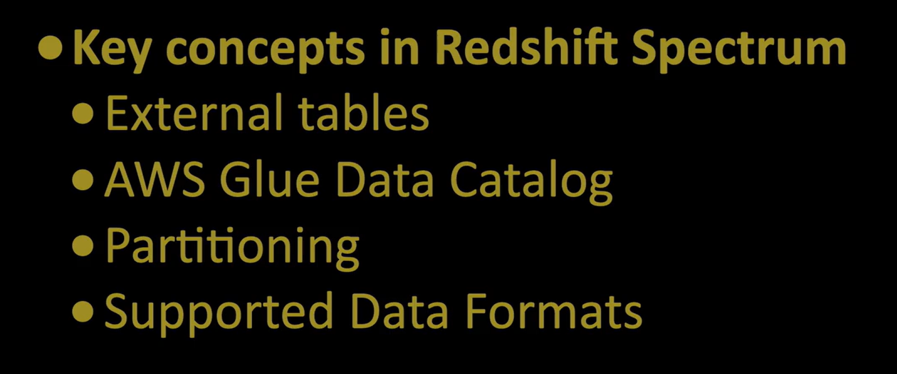
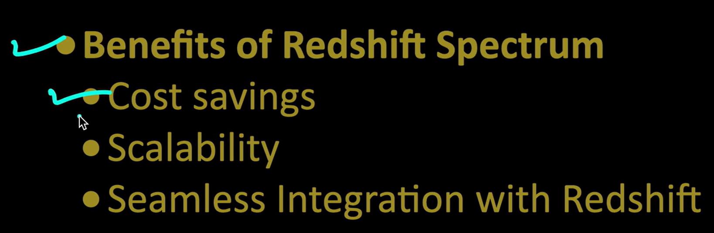
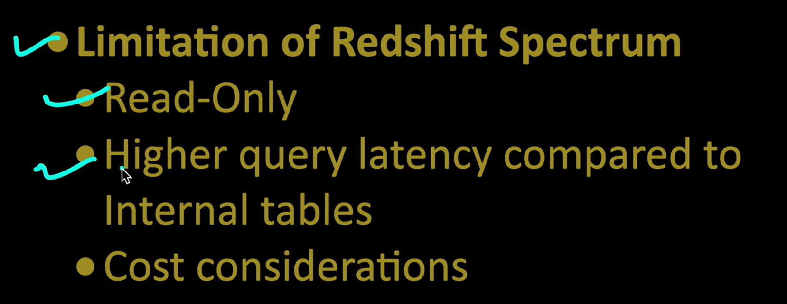
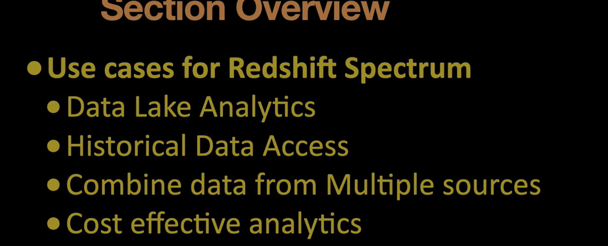
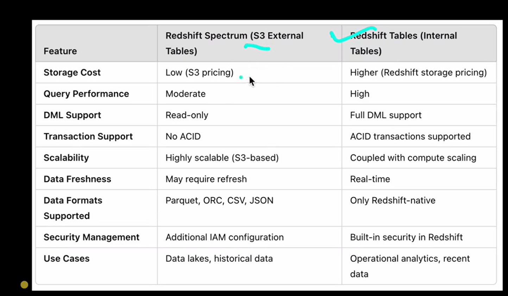
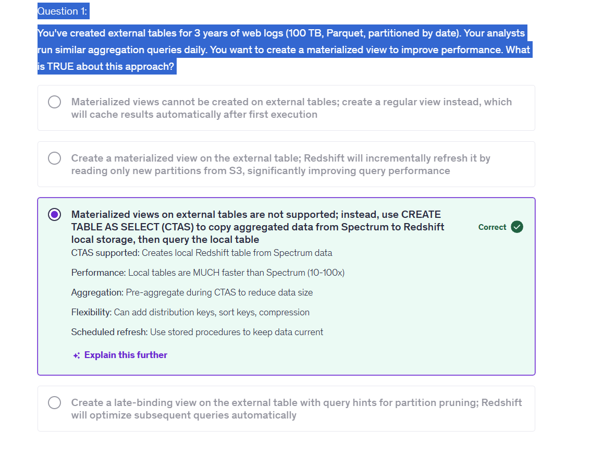
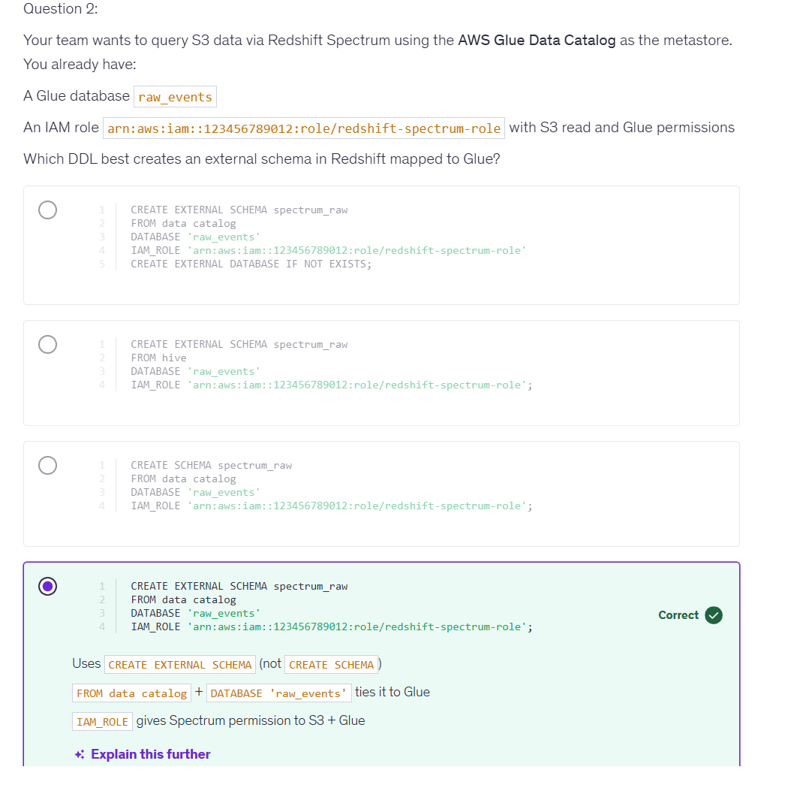
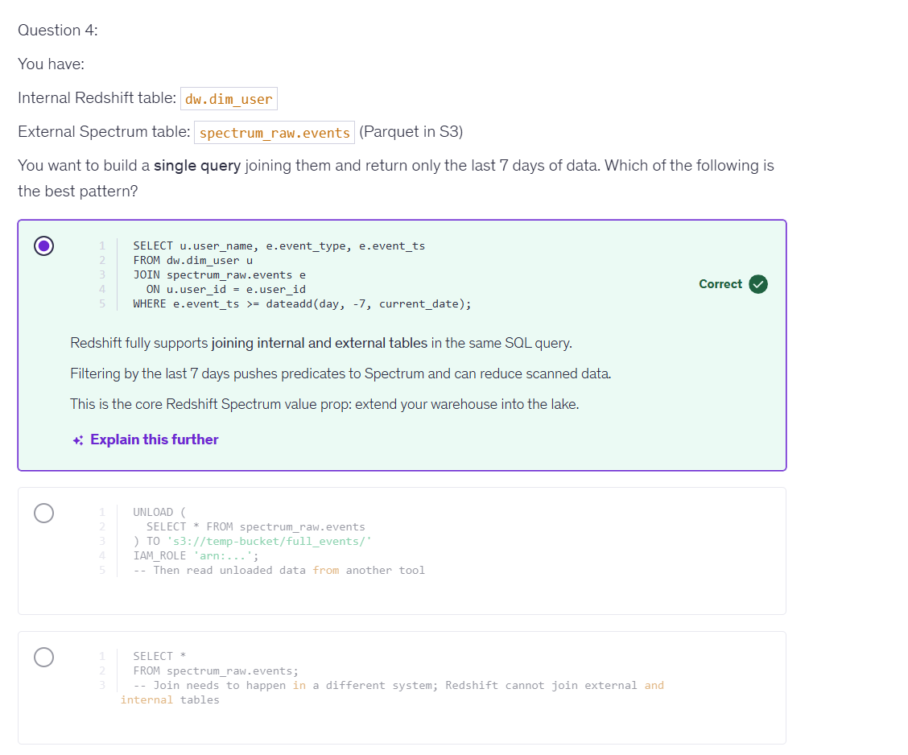

## What is Redshift Spectrum?

Redshift Spectrum is a query engine that allows you to run SQL queries against data stored in Amazon S3. It enables you to analyze large datasets without having to load them into Redshift clusters, making it easy to perform analytics on data that is already in S3.

## How to connnect the Redshift Warehouse with External Schema 

1. Step 1: Create an external schema in Redshift that points to the S3 bucket where your data is stored. You can do this using the CREATE EXTERNAL SCHEMA command.

2. Step 2: Create an external table in Redshift. Using Glue Data Catalog using crawlers.

3. Step 3: Query the external table using standard SQL queries in Redshift Query editior. You can use the SELECT statement to retrieve data from the external table, just like you would with a regular Redshift table.

## Questions

* What does ANALYZE ? 
