# What is AWS Glue -
- Aws Glue is serverless data integration service and integrate data from different different sources, once the data ready you can use it for - Analytic, Dashboarding, Machine learning and application development.

- Supported engines- Python, Spark, Ray
- Monitoring - Cloudformation metrics, job run insight, cloud trail

* Aws Glue Component 
1. Data Catalog - we can considere it is a central repository , seats between the source data and final data to pe prepared,

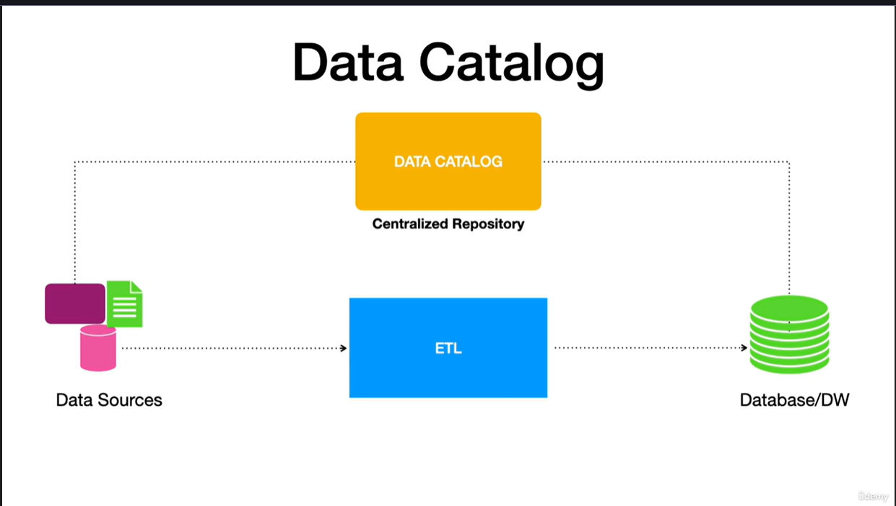
 
- A data catalog simplifies how you manage and access the data.

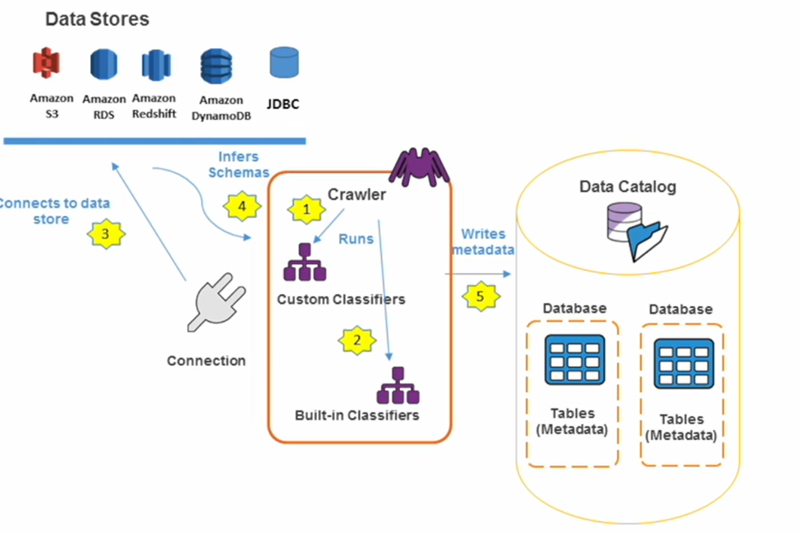

- Data catalog store the metadata, it does not stores the actual data, 
- eg.
    Database: sales
    Table: orders

    Columns:
    order_id bigint
    customer_id bigint
    amount double

    Location:
    s3://sales/orders/

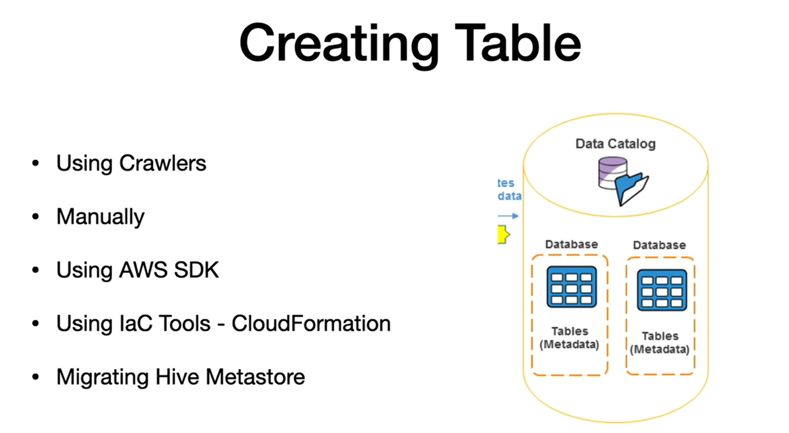

2. AWS Glue Crawler- 
- AWS Glue Crawler is an automated schema discovery service that scans data sources and infers metadata such as table names, columns, and partitions.
- In short it is the process to scan the source data and preparing the metadata, 

- Note- A crawler populates and updates the Data Catalog, but metadata can also be created manually without using a crawler.

- Crawler has two types 
- a) Custome Classifiers b) Built in classifiers.

- Workflow of Glue Crawler 
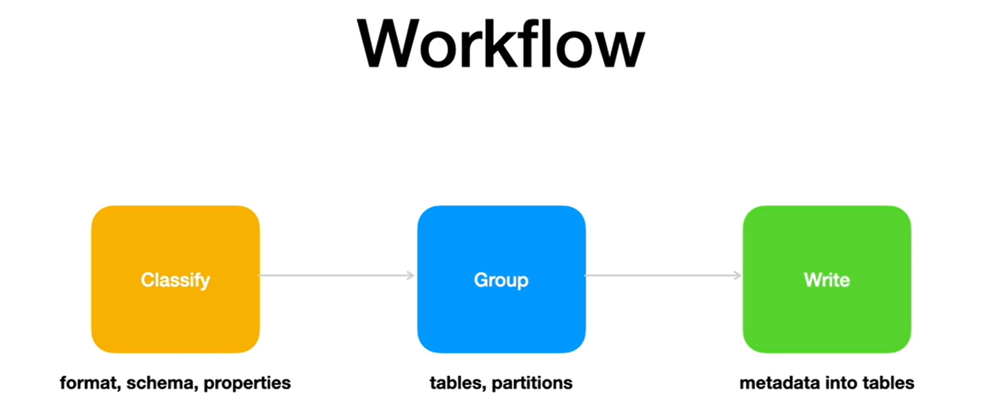

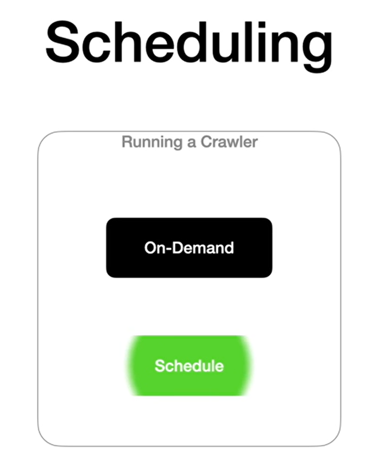

* Note - if you don't specify the database, the crawler will stored the metadata in default databases.

## Data discvoery in Glue 
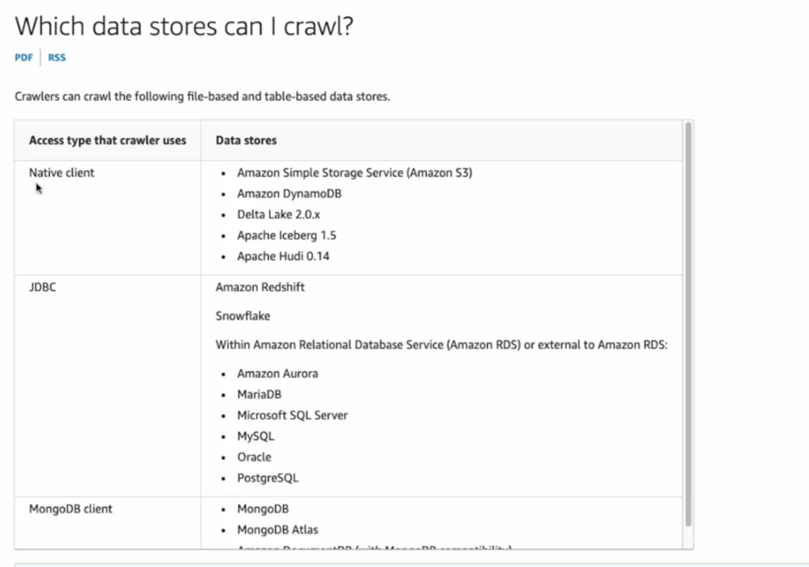

- What are native services and what does mean? 
AWS Native generally refers to cloud-native applications that are specifically designed, built, and optimized to run on Amazon Web Services (AWS) infrastructure. These applications leverage AWS-managed services, serverless computing, container orchestration, and DevOps practices to deliver scalable, resilient, and cost-efficient solutions.

At their core, AWS native applications follow cloud-native principles — microservices architecture, containerization, immutable infrastructure, and automated CI/CD pipelines — but are tightly integrated with AWS offerings like AWS Lambda, Amazon ECS/EKS, Amazon DynamoDB, and AWS API Gateway.4

### Aws Glue Built in Classifiers
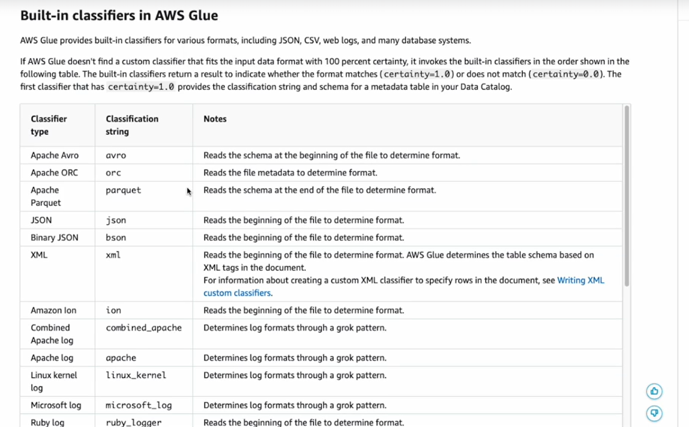

## What is Data Partitioning ? 
Data partitioning is a technique that divides large datasets into smaller, more manageable segments called partitions. In the context of AWS Glue Zero-ETL integrations, partitioning organizes your data in the target location based on specific column values or transformations of those values.
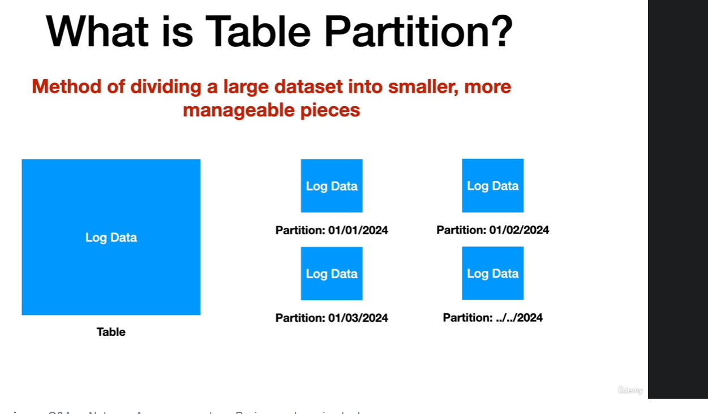

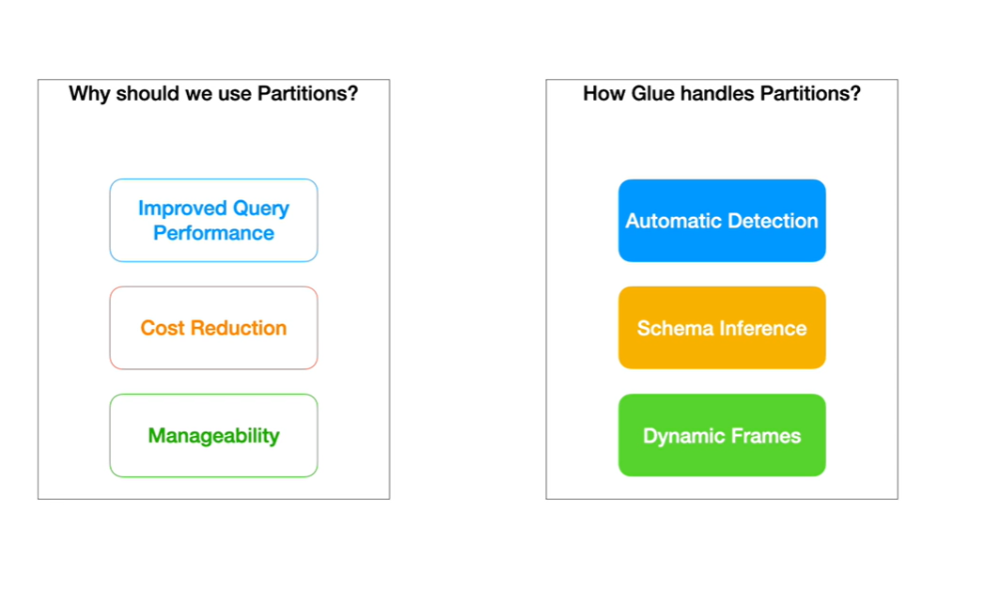
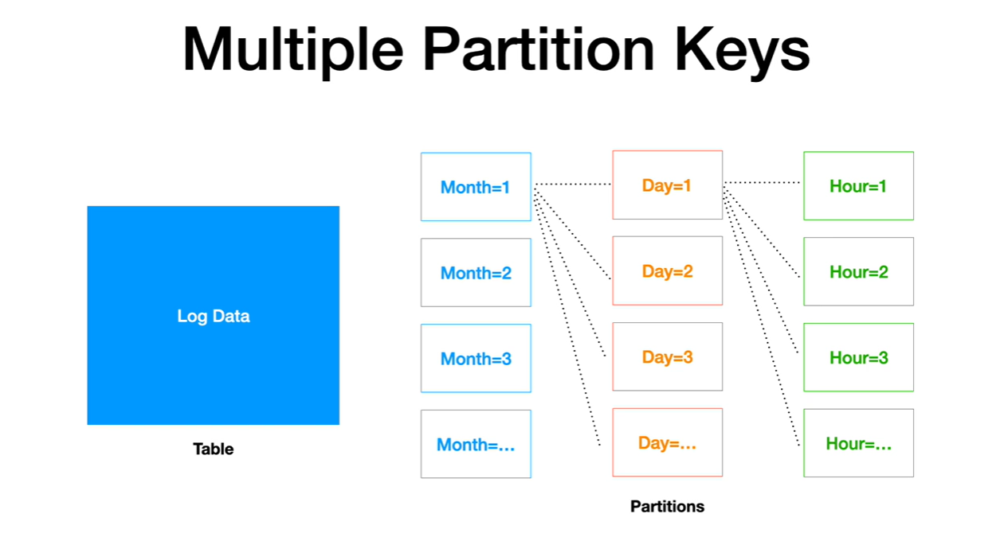

#### What is Table partitioned Index 
A partitioned index is an index created on a partitioned table. Instead of maintaining one large index for the entire table, the index can also be partitioned. In a local partitioned index, each table partition has its own corresponding index partition, which improves performance for queries that filter on the partition key and simplifies maintenance. A global partitioned index spans all table partitions and is useful for queries that don't filter on the partition key, but it is generally more expensive to maintain.

| Concept                | Purpose                                                   |
| ---------------------- | --------------------------------------------------------- |
| **Table Partitioning** | Divides a large table into smaller physical partitions.   |
| **Partitioned Index**  | Divides the index to match or work with those partitions. |

| Local Partitioned Index               | Global Partitioned Index             |
| ------------------------------------- | ------------------------------------ |
| One index per partition               | One index for all partitions         |
| Easier maintenance                    | Harder maintenance                   |
| Faster for partition-based queries    | Better for queries across partitions |
| Automatically aligned with partitions | Independent of partitions            |

- Benefits of Partition Indexes:

Faster Query Execution: By quickly locating the relevant partitions, query execution time is reduced.

Efficient Data Management: Makes it easier to manage and update partitions in heavily partitioned  datasets.

Improved Performance: Reduces the overhead of managing large numbers of partitions, particularly beneficial in data lakes with numerous partitions.

** If the number of partitions in your database table is greater than 100, you can start considering "partition indexes".

### What is Column Statistics ?
Column statistics are metadata about the values stored in each column. Query engines use them to optimize query execution. 

- *Note- It does not store the actual values of the columns, it only stored the statitistics of the column, to summarize the columns data. 

- Benifits:
These statistics are stored in the Glue Data Catalog and are used by query engines like Athena, Redshift data warehouse and Spark to estimate data distribution, optimize joins, improve filter and aggregation planning, reduce unnecessary scans, and generate more efficient execution plans. The statistics describe the data—they do not contain the data itself.

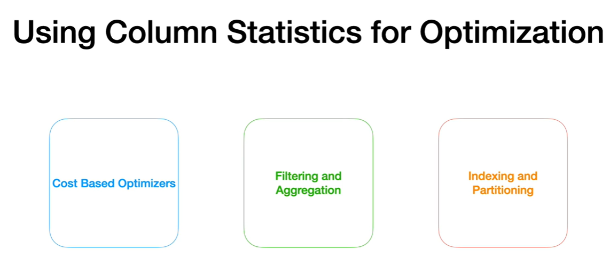

- Types of Column Statistics

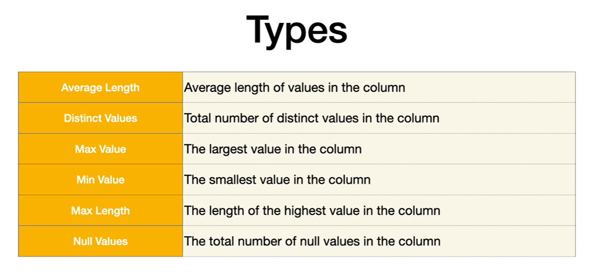

- How to Generate Column Statistics 

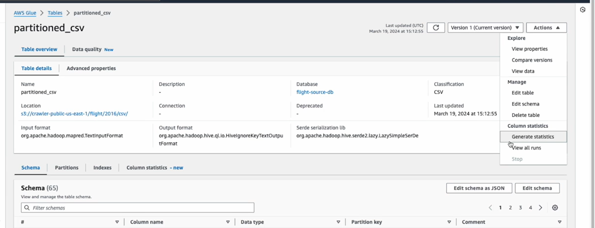

- Also need to add IAM Role with below managed and custom policies, 

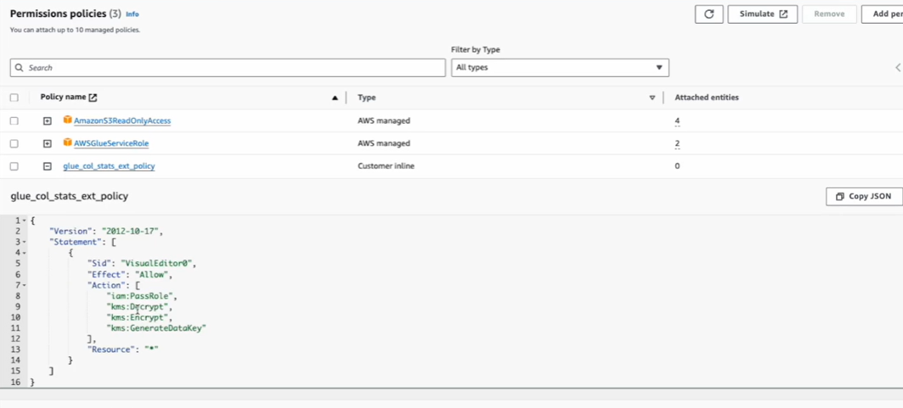

### Visual ETL Jobs in Glue
- The visual ETL Jobs are created by using drag and drop plugin connections. 
- Visual ETL Jobs based on the Apache Spark Engine.

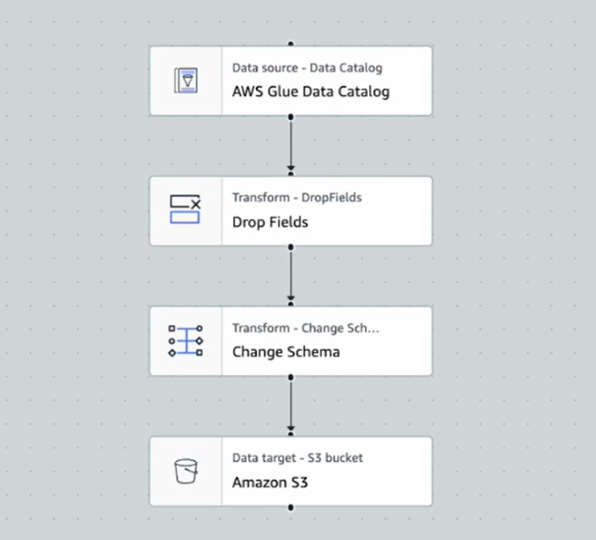

-- Some Built In Transformation in Glue Studio

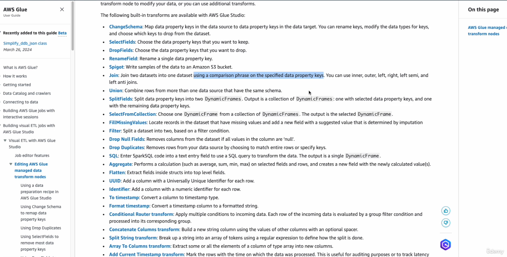

#### Add a custom Transorf in Glue (Example)
- Upload both the file in Glue s3 bucket.

Custom Transform
1. demo_transform_cancelled.py

from awsglue import DynamicFrame
 
def remove_cancelled_flights(self, cancelled_col_name):
    return self.filter(lambda rec: rec[cancelled_col_name] != 1)
   
DynamicFrame.remove_cancelled_flights = remove_cancelled_flights

2. demo_transform_cancelled.json

{
"name": "demo_transform_cancelled",
"displayName": "Remove Cancelled Flights",
"description": "A simple example to remove the cancelled flights entries from the flights data set",
"functionName": "remove_cancelled_flights",
"parameters": [
   {
    "name": "cancelled_col_name",
    "displayName": "Cancelled Column",
    "type": "str",
    "description": "Name of the column in the data that holds the cancelled value",
    "listOptions": "column"
   }
  ]
}

## What are the Magic Command in Jupyter Notebook Interacactive Shell 
In AWS Glue interactive sessions for Jupyter notebooks, magic commands are shortcut configurations prefixed with % (line magics) used to set up compute resources, IAM roles, and external libraries before running your PySpark code. 

- eg. 
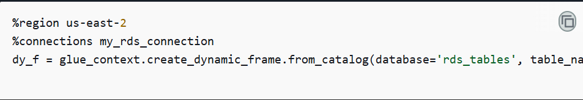

[Read More about Magic Command Resource](https://docs.aws.amazon.com/glue/latest/dg/interactive-sessions-magics.html)

[Job Parameters in Glue](https://docs.aws.amazon.com/glue/latest/dg/aws-glue-programming-etl-glue-arguments.html#job-parameter-reference)

[Configuration for Job Property in Glue Jobs](https://docs.aws.amazon.com/glue/latest/dg/add-job.html)

[Monitoring with AWS Glue Observability metrics](https://docs.aws.amazon.com/glue/latest/dg/monitor-observability.html)
## Note- AWS Glue for Ray is no longer open to new customers.(Aws recommended- Amazon Elastic Kubernetes Servic(AEkS))

## AWS CloudFormation

- AWS CloudFormation (CFT) is an Infrastructure as Code (IaC) service provided by Amazon Web Services (AWS). It allows users to model, provision, and manage AWS resources in a declarative and automated manner. Instead of manually configuring resources, you define them in templates written in JSON or YAML, and CloudFormation takes care of creating, updating, and managing those resources.

* Key Features of AWS CloudFormation

1. Infrastructure as Code: Define your infrastructure in reusable templates, enabling consistent and repeatable deployments.

2. Automation: Automates the provisioning and configuration of AWS resources, reducing manual effort and errors.

3. Scalability: Easily scale resources up or down based on application needs.

4. Multi-Region Deployments: Replicate infrastructure across multiple AWS regions for high availability and disaster recovery.

5. Change Management: Track and control changes to your infrastructure using version-controlled templates and change sets.
