## How Partitioning Works in S3 Buckets

- Partitioning in S3 buckets is a method of organizing data to improve performance and manageability. It involves dividing data into distinct segments, or partitions, based on specific criteria such as date, region, or other attributes. This allows for more efficient querying and retrieval of data, as well as better scalability.

- When you partition your data in S3, you can create a hierarchical structure that makes it easier to locate and access specific subsets of data. For example, you might partition your data by year and month, creating folders for each year and subfolders for each month. This way, when you need to access data from a specific time period, you can quickly navigate to the relevant folder without having to sift through unrelated files.

## How to enable partitioning in S3 buckets

- To enable partitioning in S3 buckets, you can use the following steps:
1. **Define Partitioning Strategy**: Determine the criteria for partitioning your data. This could be based on time (e.g., year/month/day), geographic location, or any other relevant attribute.
2. **Organize Data**: Structure your data in S3 according to the defined partitioning strategy. Create folders or prefixes that represent each partition, and place the corresponding data files within those folders.

3. Run the Glue crawler to catalog the data and recognize the partitioned structure. This will allow you to query the data using tools like Amazon Athena or Redshift Spectrum. Glue data catalog stores metadata about the partitioned data, making it easier to query and analyze.

3. **Use S3 Select or Athena**: If you are using S3 Select or Amazon Athena, you can take advantage of partitioning to optimize your queries. When querying partitioned data, specify the partition keys in your query to limit the amount of data scanned, which can significantly improve performance and reduce costs.


## Amazon S3 Life Cycle Management (S3 Storage Class Analysis)

1. **Define Lifecycle Policies**: Use S3 Lifecycle policies to automatically transition objects between different storage classes based on their age or access patterns. For example, you can move older data to cheaper storage classes like S3 Glacier or S3 Intelligent-Tiering.

2. **Set Expiration Rules**: You can also set expiration rules to automatically delete objects that are no longer needed after a certain period. This helps manage storage costs and keeps your S3 bucket organized.

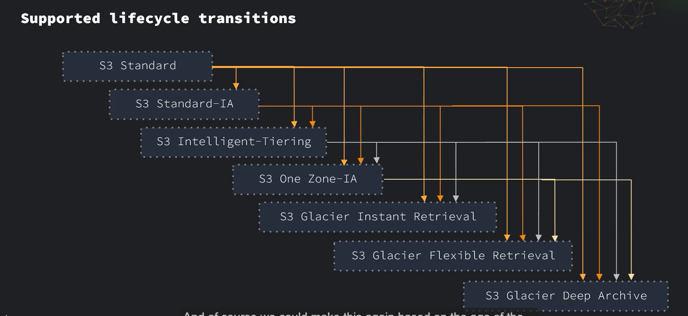

3. **Set Transition Rules**: Define rules to transition objects to different storage classes based on their age or access patterns. For example, you can transition objects to S3 Standard-IA after 30 days of inactivity, and then to S3 Glacier after 90 days.

## What are the Different S3 Storage Classes?

- Amazon S3 offers several storage classes to help you optimize costs and performance based on your data access patterns. The main storage classes include:
1. **S3 Standard**: Designed for frequently accessed data, offering low latency and high throughput. Ideal for a wide range of use cases.

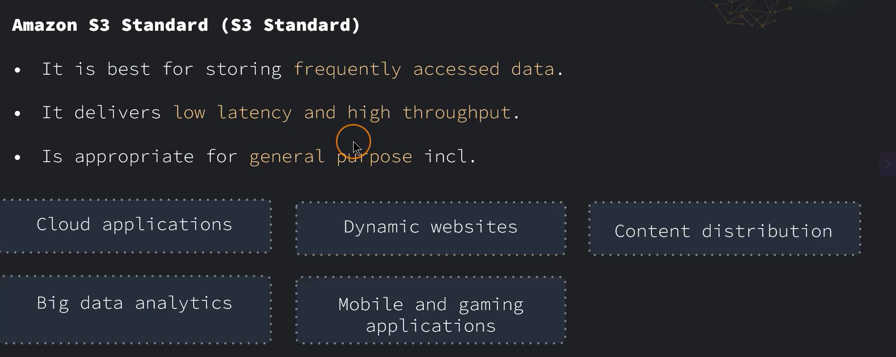

2. **S3 Intelligent-Tiering**: Automatically moves data between two access tiers (frequent and infrequent) based on changing access patterns, helping to optimize costs without performance impact. `If the data is not accessed for 30 consecutive days, it will be moved to the infrequent access tier.` and `If data is not accessed for 90 consecutive days, it will be moved to the archive access tier.` and `If data is not accessed for 60 consecutive days, it will be moved to the deep archive access tier.`

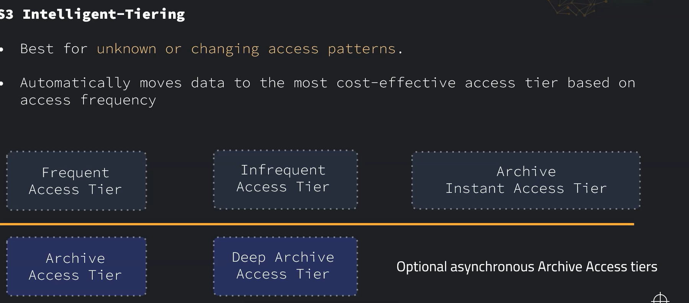

3. **S3 Standard-IA (Infrequent Access)**: Suitable for data that is accessed less frequently but requires rapid access when needed. It offers lower storage costs compared to S3 Standard.

4. **S3 One Zone-IA**: Similar to S3 Standard-IA but stores data in a single availability zone, making it a lower-cost option for infrequently accessed data that can be recreated if the availability zone fails. 
5. **S3 Glacier**: Designed for long-term archival of data that is infrequently accessed. It offers low storage costs but has higher retrieval times compared to other storage classes.

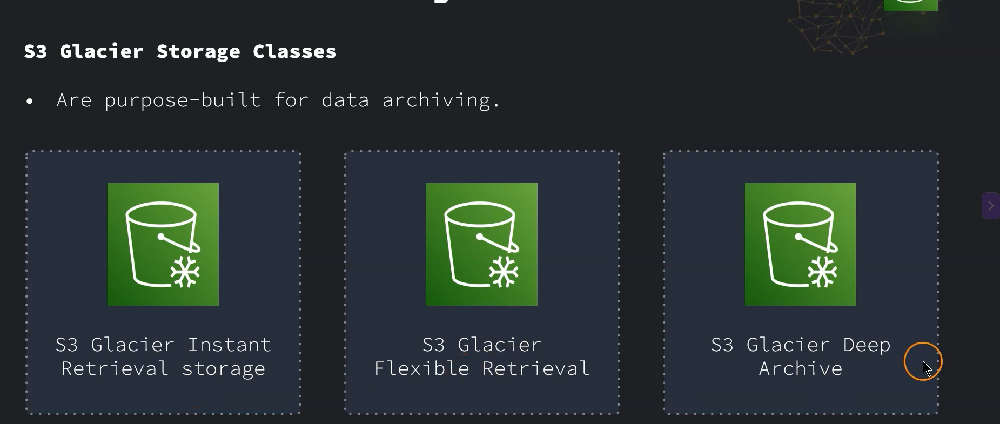

* 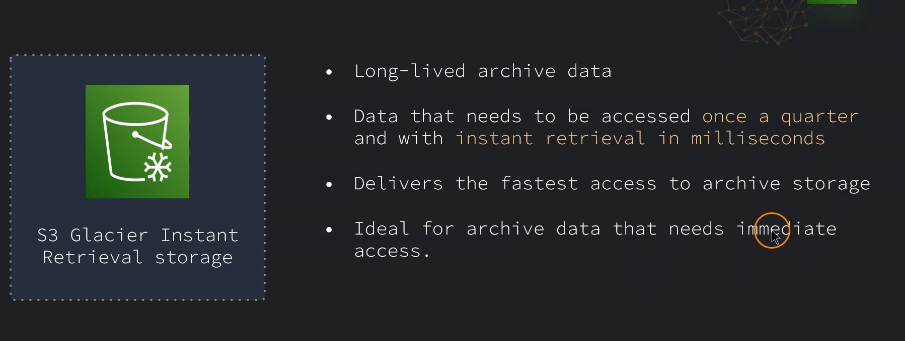

* 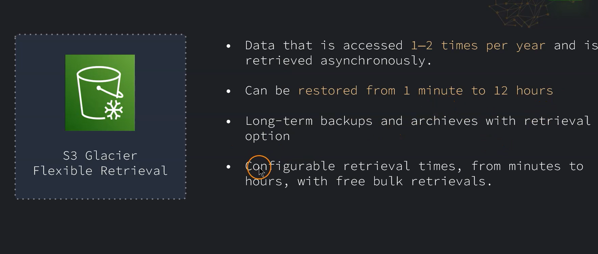

* 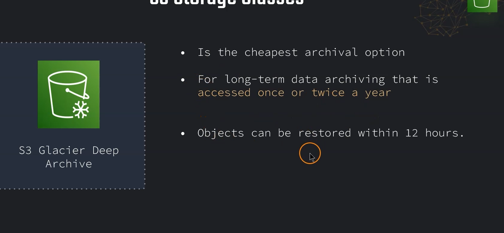

## Versioning in S3 Buckets

- Versioning in S3 buckets is a feature that allows you to keep multiple versions of an object in the same bucket. This can be useful for data recovery, auditing, and maintaining historical records of your data.
- To enable versioning, you can use the S3 console, AWS CLI, or SDKs. Once versioning is enabled, every time you upload a new version of an object, S3 will automatically create a new version ID for that object.
- You can retrieve previous versions of an object by specifying the version ID in your request. This allows you to restore or access older versions of your data as needed.
- Versioning can also help protect against accidental deletions or overwrites, as you can recover previous versions of an object even if the current version is deleted or modified.

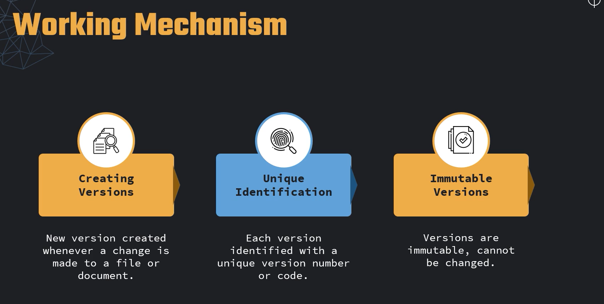

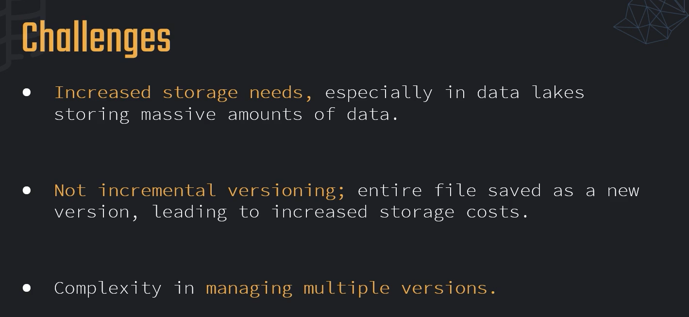\

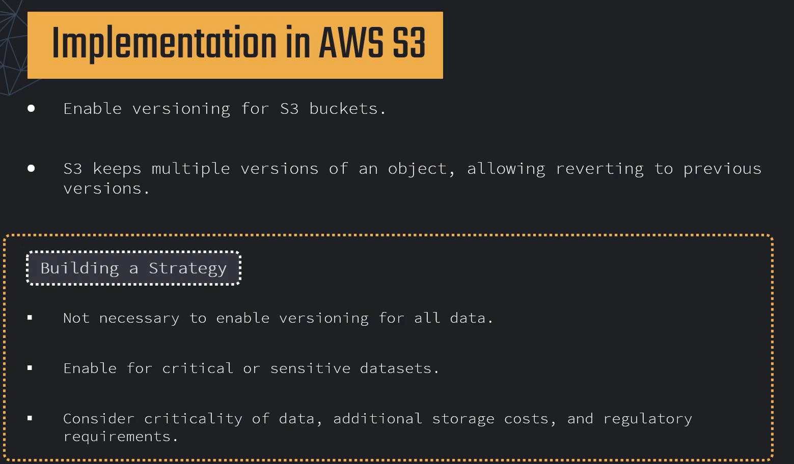

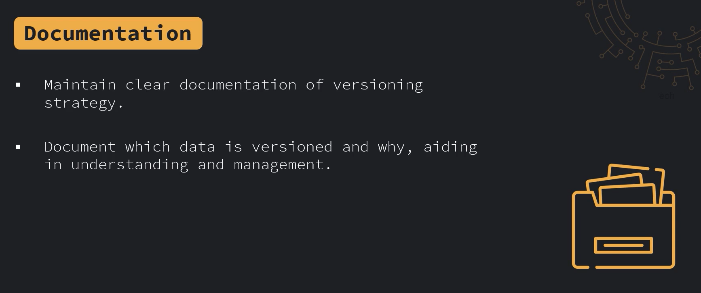

- Versioning can be affect ed by lifecycle policies, which can be used to automatically delete or transition older versions of objects based on your defined rules. This helps manage storage costs and keeps your S3 bucket organized.

- Need to update the lifecycle policies to include versioning rules, such as setting expiration for non-current versions or transitioning them to cheaper storage classes. This ensures that your S3 bucket remains cost-effective while still retaining important historical data.

## How to delete a versioned object in S3
- To delete a versioned object in S3, you can use the following steps:
1. **List Object Versions**: Use the S3 console, AWS CLI, or SDK
    to list all versions of the object you want to delete. This will show you the version IDs associated with that object.
2. **Delete Specific Version**: Once you have the version ID of the object you want to delete, you can use the S3 console, AWS CLI, or SDK to delete that specific version. This will remove that version from the bucket while keeping other versions intact.


## Amazon S3 Cross-Region Replication (CRR)
- Amazon S3 Cross-Region Replication (CRR) is a feature that allows you to automatically replicate objects from one S3 bucket to another bucket in a different AWS region. This can help improve data durability, availability, and compliance with regulatory requirements.

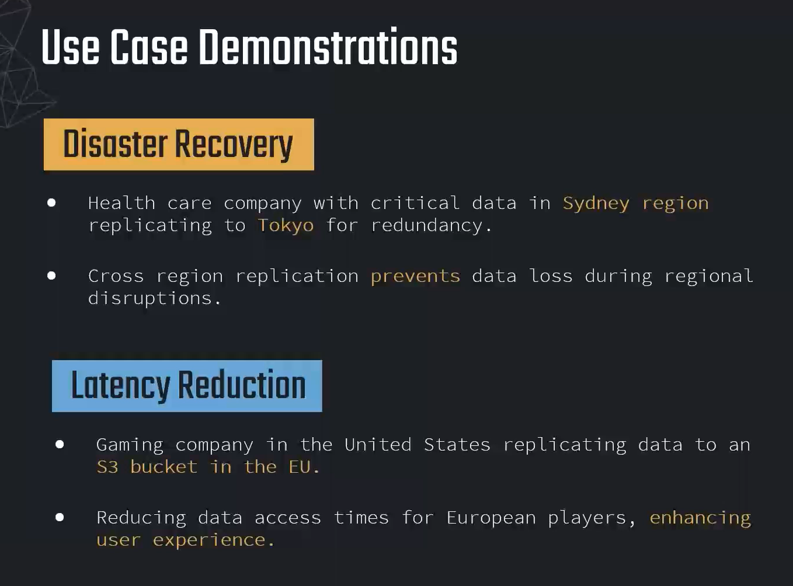

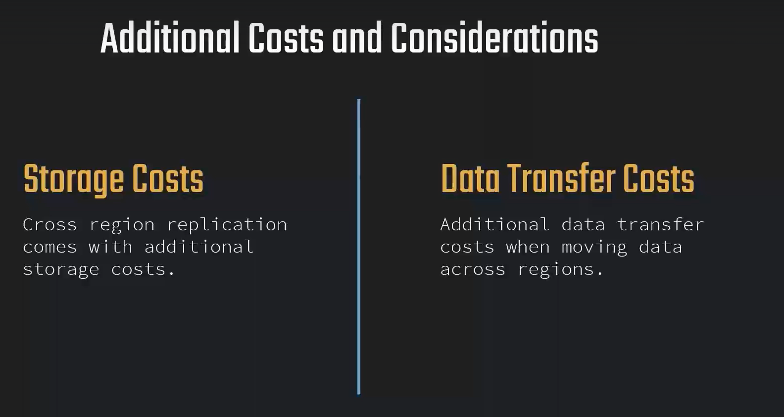

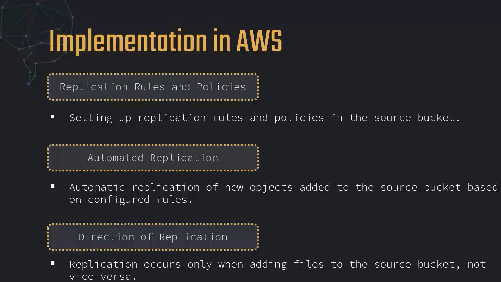

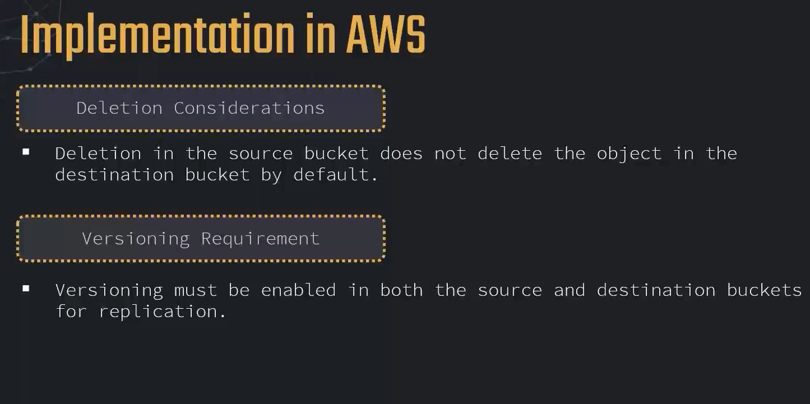

## Encryption in S3 Buckets
- Amazon S3 provides several options for encrypting data at rest and in transit to help protect your data from unauthorized access. You can choose from server-side encryption (SSE) or client-side encryption (CSE) based on your security requirements.

- **Server-Side Encryption (SSE)**: S3 offers three types of server-side encryption:
1. **SSE-S3**: Amazon S3 manages the encryption keys for you.
2. **SSE-KMS**: You can use AWS Key Management Service (KMS) to manage your encryption keys, providing additional control and auditing capabilities.
3. **SSE-C**: You can provide your own encryption keys for S3 to use when encrypting and decrypting your data.

- **Client-Side Encryption (CSE)**: You can encrypt your data on the client side before uploading it to S3. This gives you full control over the encryption process and key management.
- **In-Transit Encryption**: S3 supports HTTPS for secure data transfer between your application and S3, ensuring that your data is protected while in transit.

- **Best Practices for Encryption**:
1. Use SSE-KMS for sensitive data to take advantage of AWS KMS features such as key rotation and access control.
2. Regularly audit your encryption settings and access policies to ensure compliance with security standards.

- **Note**: Always ensure that your encryption keys are securely managed and that you have a backup strategy in place to prevent data loss.

- In short while uploading the data to s3 data is encrypted and while downloading the data from s3 data is decrypted.

## Bucket Policies and Access Control
- Amazon S3 provides several mechanisms for controlling access to your buckets and objects, including bucket policies, access control lists (ACLs), and AWS Identity and Access Management (IAM) policies.
- **Bucket Policies**: Bucket policies are JSON-based access control policies that you can attach to your S3 bucket. They allow you to define permissions for specific users, groups, or AWS accounts, and can be used to grant or deny access to your bucket and its objects.
- **Access Control Lists (ACLs)**: ACLs are another way to manage access to your S3 resources. They allow you to specify permissions for individual objects or buckets, and can be used to grant read or write access to specific users or groups.
- **IAM Policies**: IAM policies are used to manage access to AWS resources, including S3. You can create IAM policies that define permissions for specific users or groups, and attach those policies to IAM roles or users to control access to your S3 buckets and objects.

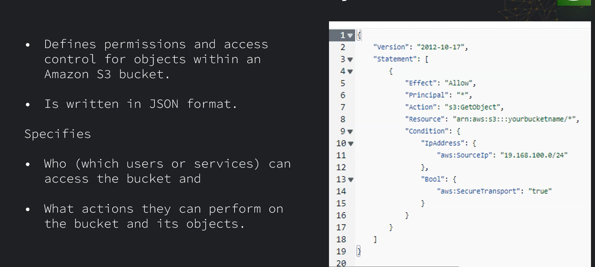

## Access Points in S3 Buckets

`Amazon S3 Access Points are named network endpoints with dedicated access policies used to manage data access at scale for shared datasets in Amazon S3`.

### Why Use S3 Access Points?
- Managing a single, massive bucket policy for hundreds of applications with different permissions is difficult, error-prone, and can hit bucket policy size limits. Access points solve this by breaking down a single large bucket policy into distinct, manageable control points for individual applications or teams.

- Amazon S3 Access Points simplify managing data access at scale for shared datasets in S3. Each access point has its own policy and can be used to enforce specific permissions for different applications or users accessing the same bucket.


#### Key Features and Capabilities

1. Individualized Access Policies: Each access point has its own resource-based IAM policy. You can tailor permissions specifically for the application using that exact endpoint.
2. Network Isolation: You can restrict an access point to only accept traffic from a specific Virtual Private Cloud (VPC). This blocks all public internet access to the data through that path.
3. Unique Amazon Resource Names (ARNs): Applications reference the access point ARN rather than the bucket ARN to perform data operations (like GetObject and PutObject).
4. Massive Scale: You can create thousands of access points per AWS account and per region, eliminating the risk of hitting the 20 KB bucket policy size limitation.
5. Block Public Access: Each access point includes its own Block Public Access settings, allowing you to enforce strict public restrictions independently of the underlying bucket configuration.

**How it works**:

```[ Application A ] ---> [ Access Point A (VPC Only Policy) ] ---\
                                                                ===> [ Single Shared S3 Bucket ]
[ Application B ] ---> [ Access Point B (Read-Only Policy) ] ---/ 
```
---

### Common Use CasesShared Data Lakes: 
- A central analytics bucket can grant Read-Only access to a data science team via one access point, while granting Read/Write access to an ingestion pipeline via another.

- Internal Application Isolation: Ensuring compliance by forcing internal financial applications to access S3 data strictly through VPC-bound access points, preventing accidental external exposure.

## Object Lambda in S3 Buckets

- Amazon S3 Object Lambda allows you to add your own code to process data retrieved from S3 before returning it to an application. This enables you to modify and transform data on-the-fly without needing to store multiple versions of the same object.

- Instead of storing multiple static variations of a single dataset—such as redacted files or resized images—you store one master file and transform it on the fly when an application requests it.

**How It WorksThe Request:**
1. An application sends a standard request (like GetObject) to the Object Lambda Access Point ARN instead of the raw bucket.
2. The Trigger: S3 automatically calls the attached AWS Lambda function and passes the requested object data to it.
3. The Transformation: Your code processes the data in memory (redacting text, changing formats, or resizing).
4. The Response: The function streams the transformed result back to the calling application.

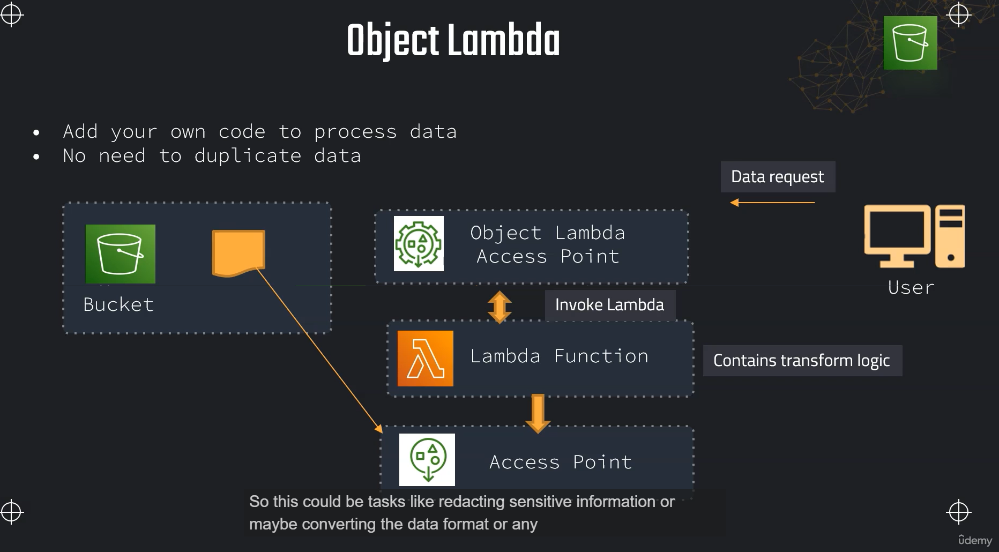

#### **Common Use Cases**
- **Data Redacting**: Automatically mask or remove sensitive personal identifiable information (PII) for specific users.
- **Format Conversion**: Translate data dynamically, such as converting a file from XML to JSON or CSV.
- **Image Resizing**: Alter image dimensions on the fly based on the requesting device's resolution needs.
- **Data Enrichment**: Add extra metadata or append external database details to log files during retrieval.

#### Key Benefits
- **No Data Duplication**: Saves storage costs by eliminating the need to save redundant derived copies of objects.
- **Seamless Integration**: Works with existing standard S3 APIs (GetObject, HeadObject, ListObjects) without altering core infrastructure.
- **Custom Security**: Allows fine-grained access control so different teams get tailored views of the same master dataset.